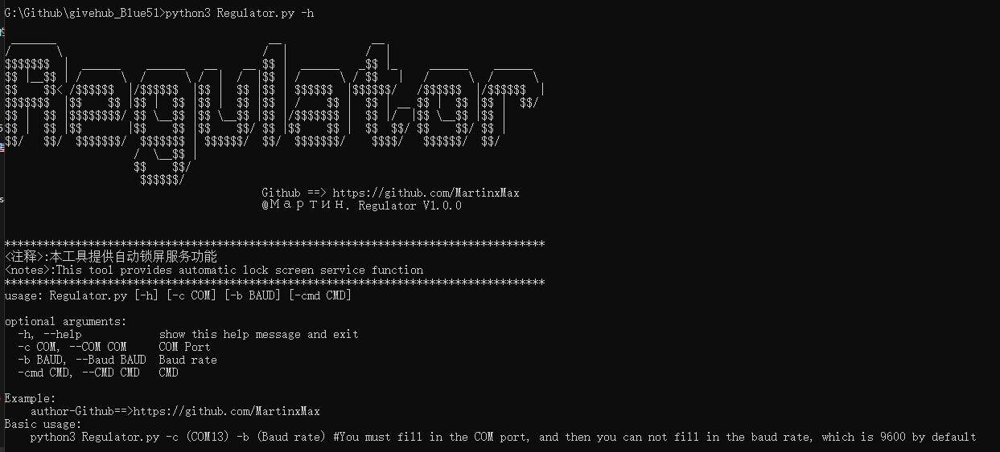
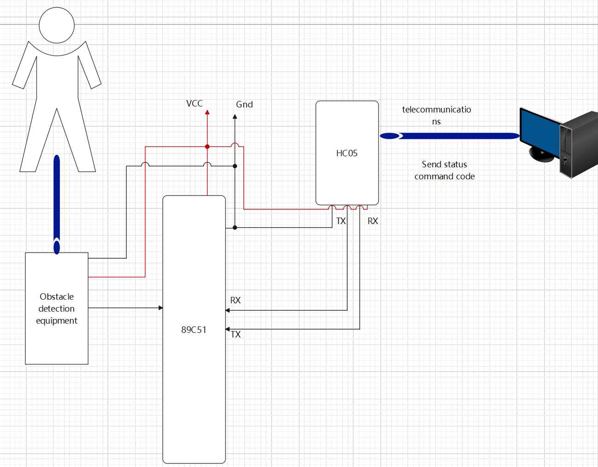
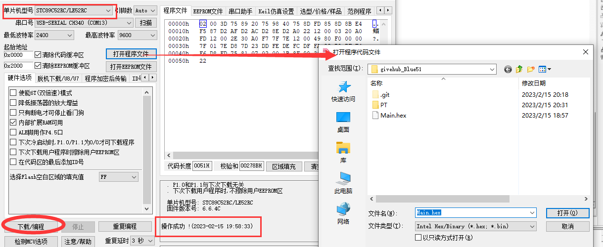
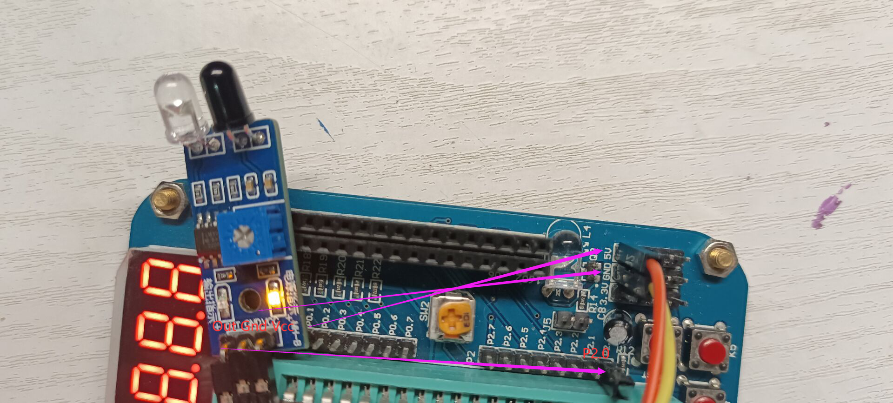
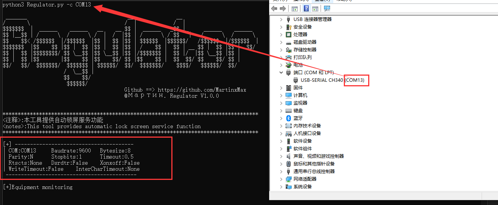
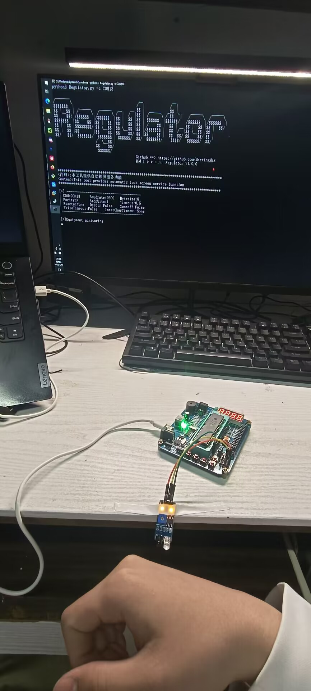
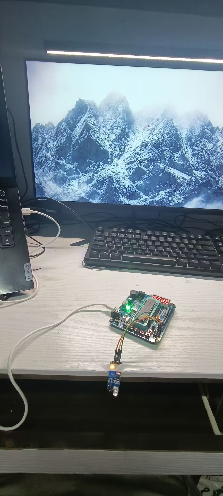
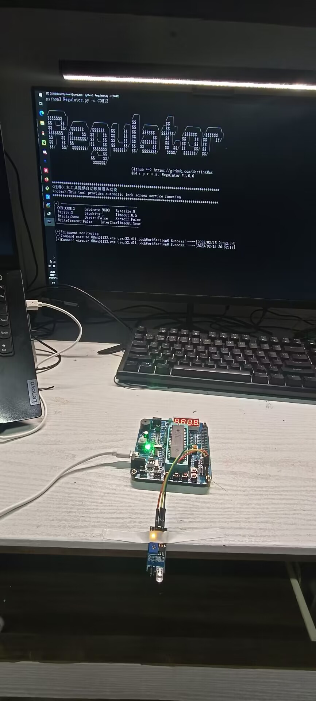
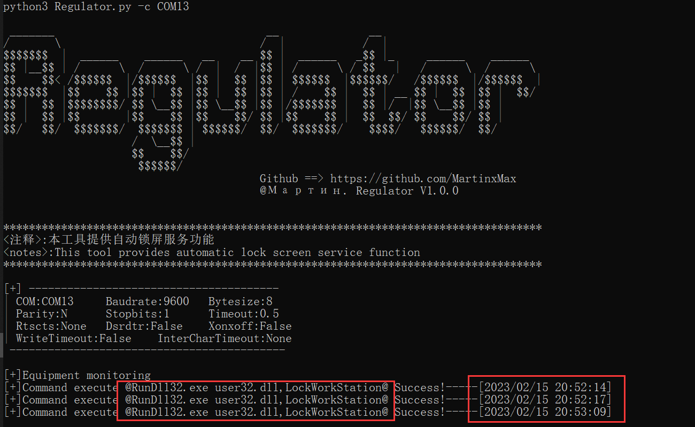
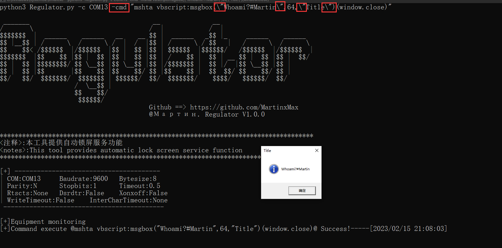

<div align="center">
 
 <p align="center">
 
 
 
  
 
 </p>
   
 <table>
  <tr>
      <th>Function</th>
  </tr>
  <tr>
    <th>Leave the automatic screen</th>
  </tr>
  <tr>
    <th>Inductively execute shell commands</th>
 </table>
</div>

## usage method
  * View help information

      ```#python3 Regulator.py -h```

  

## Demo
[ps]The project document drawing v2.0.0 will use Bluetooth communication protocol, and the serial port will be used for testing this time

  

1.Burn hex file to 51 single-chip ne

  

2.Configuration circuit

  

3.Operation monitoring program

_You can use the - b parameter to set the baud rate, which is 9600 by default_
 ```#python3 Regulator.py -c COM13```

  

4.After the human body is seated, it will automatically enter the combat readiness state

  

5.Auto lock screen

  

6.results of enforcement

  
  

## You can not only lock the screen, but also specify commands

   ```#python3 Regulator.py -c xxx -cmd "xxxx"```

  
