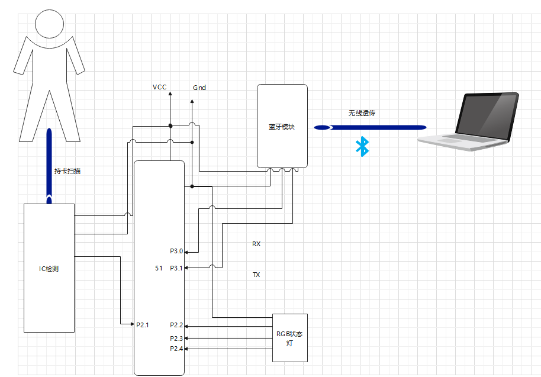
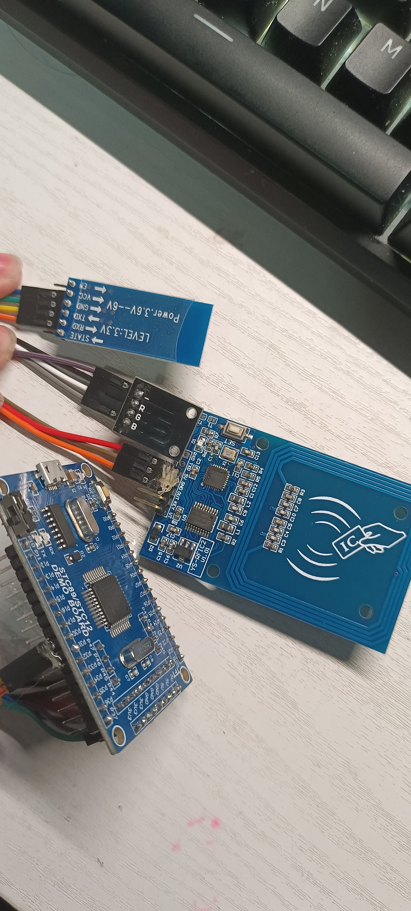
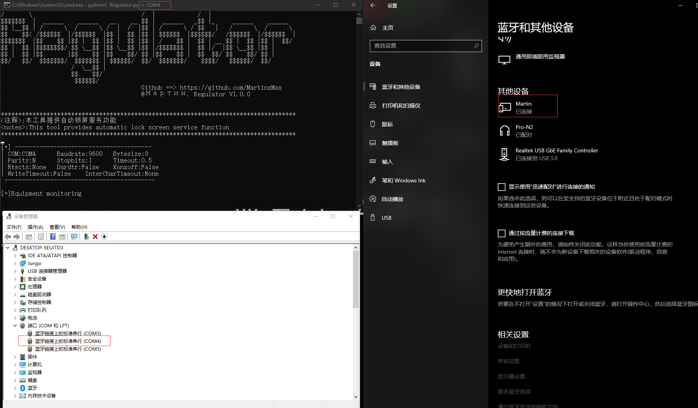
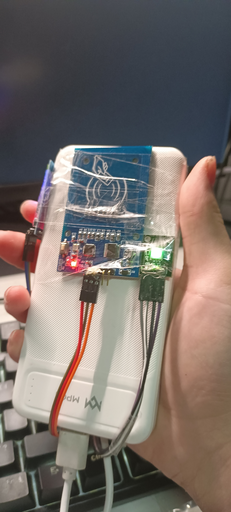
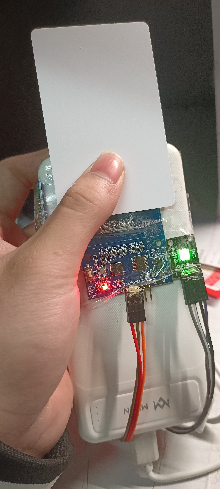
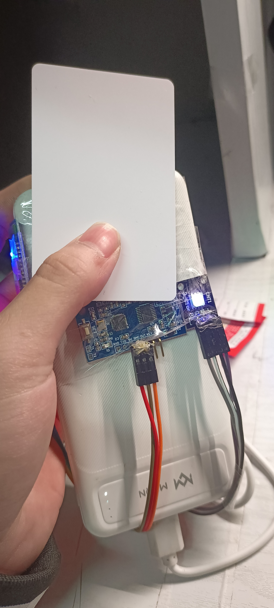
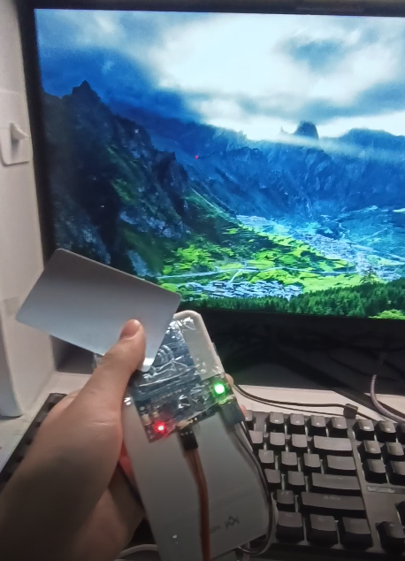
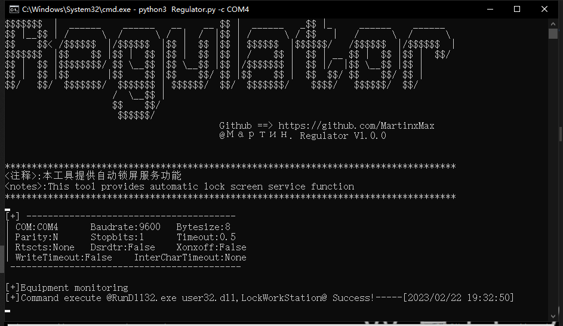

<div align="center">
 
 <p align="center">
 
 
 
  
 
 </p>
   
 <table>
  <tr>
      <th>Function</th>
  </tr>
  <tr>
    <th>Leave the automatic screen</th>
  </tr>
  <tr>
    <th>Inductively execute shell commands</th>
 </table>
</div>

## usage method
  * View help information

      ```#python3 Regulator.py -h```

  

## Demo
Bluetooth wireless remote control
  

1.Burn hex file to 51 single-chip ne

  

  

2.Connect Bluetooth
  


_You can use the - b parameter to set the baud rate, which is 9600 by default_
 
```#python3 Regulator.py -c COM4```

  

4.Wait for the IC card to intervene, and the remote command will be executed

  

  

  

5.Specify the lock screen command be

  

  

 
## You can not only lock the screen, but also specify commands

   ```#python3 Regulator.py -c xxx -cmd "xxxx"```

  
